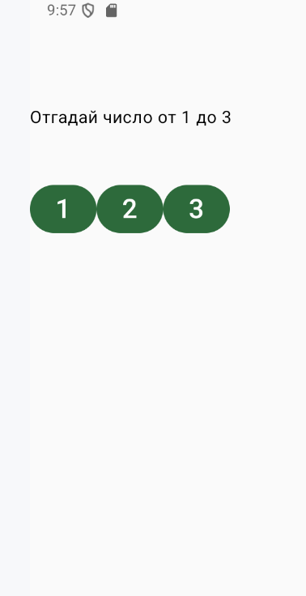
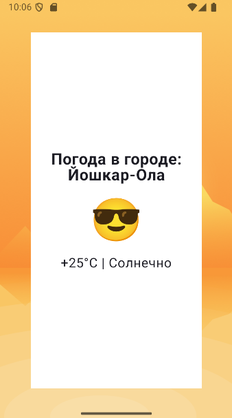
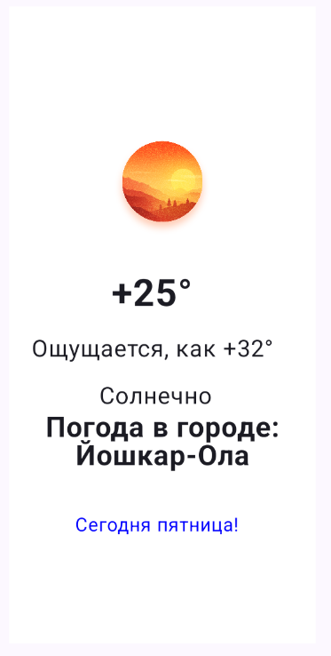
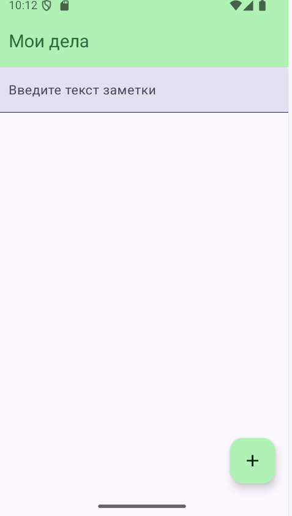
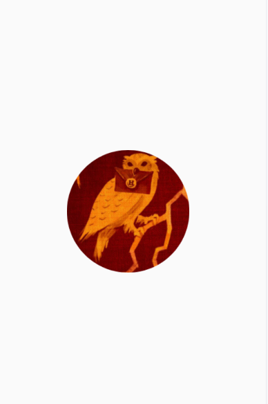
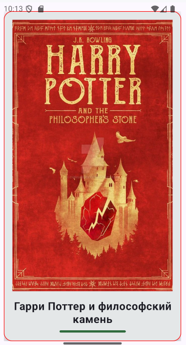
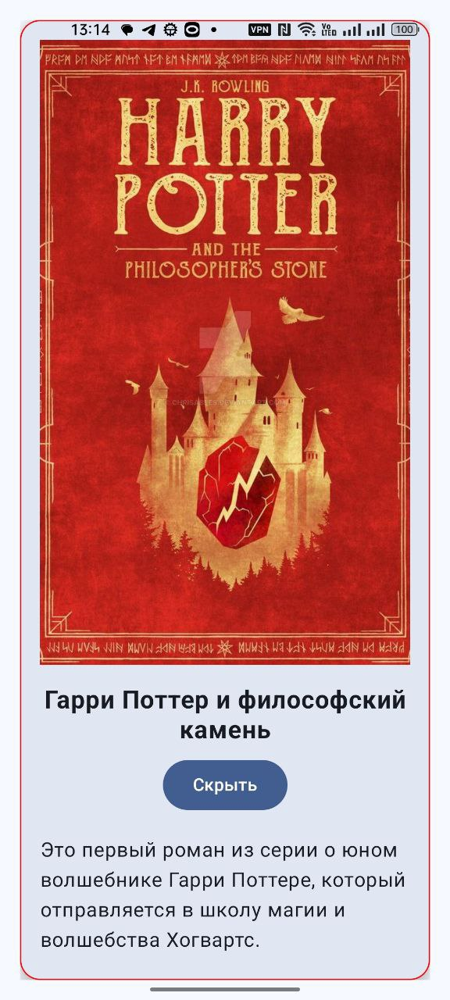
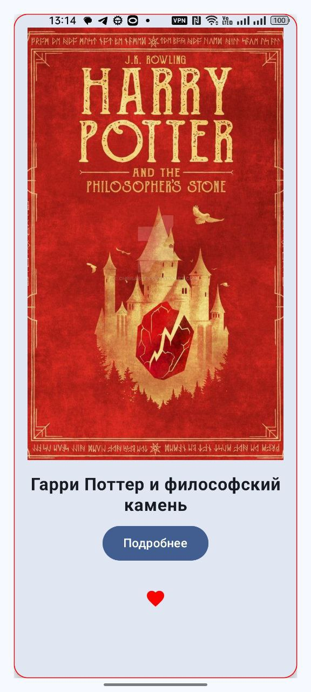
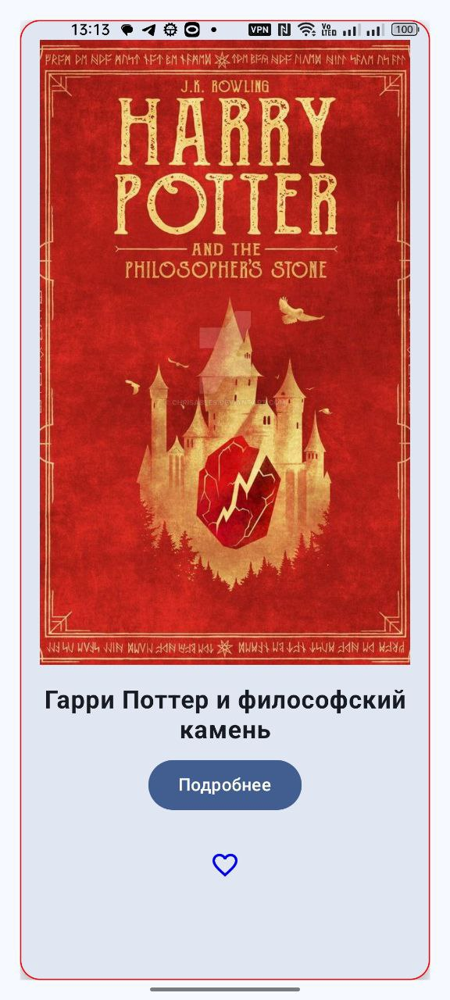

# AndroidLearnProjects
 AndroidLearnProject

 </br>

<!-- GETTING STARTED -->
## Getting Started

### Installation

1. Open Android Studio
2. Select the menu item "File" -> "New" -> "Project from Version Control"
3. Clone the repo
   ```sh
   git clone https://github.com/fevfev/Github.git
   ```

</br>

# Погружаемся в мир Android: Jetpack Compose и Material Design 3 🌌📱

Добро пожаловать в увлекательное путешествие по разработке Android приложений!  

## Проект 1: ThreeNumbers 🧮



### Задание:
Пример использования простейших  функций kotlin

### Кратко

Выводим 3 кнопки для игры, угадай загаданное число, число выберается случайно. Выбор кнопки пользователем. 

- Простейшая проверка на if.
- Кнопки для чисел и операций.
- Отображение результата.

### Доработки 
- поменять логику выбора
- изменить цвет кнопки 
```
https://metanit.com/kotlin/jetpack/4.2.php
```
- по желанию добавить свои элементы.

---

## Проект 2: CV/Резюме 👨‍💼


### Задание: Цифровое резюме, где будут отображаться ваша фотография, ФИО, адрес и другие детали


### Кратко 
- Вывести картинку профиля, добавить текстовые поля со своими данными, например группы, адрес, ссылки на соц сети. 


### Доработки

- создать свои блоки с информацией о себе, например навыки
- изменить оформление темы 
- изменить изображение профиля
- изменить иконки приложения и splash screen
- добавиить ссылки с иконками на профили в социальных сетях

---

## Проект 3: Погода в городе 🌦️



### Задание: Приложение показывает заготовленную карточку погоды в городе Йошкар-Ола.


### Кратко 
- Заголовок с названием города.
- Иконка погоды.
- Текст с температурой и состоянием погоды.
- Информация о погоде



### Доработки
- Изменить погоду на свой выбор, например дождь, снег и тд. Соответсвенно поменять картинки, иконки, текст
- Изменить оформление приложения
- Добавить свои блоки


---

## Проект 4: Приложение для заметок 📝



### Задание: Базовый интерфейс приложения для добавления заметок


### Кратко 
- Добавить поле для ввода текста
- Добавить кнопку для добавления заметок
- Вывести список заметок

### Доработки

- Разделить задачи divider
- Добавить категории задач

---

## Проект 5: Карточка книги 😊





### Задание: Приложение показывает заготовленную карточку товара


### Кратко на карточке есть
- Изображение
- Название книги
- Краткое описание
- Кнопка подробнее раскрывающая описание
- Добавление иконки избранное с отслеживанием состояние
- Добавление анимации раскрытия карточки и смены избранного

### Доработки

- Изменить колонку на LazyColumn
- Добавить анимаций
- Поменять оформление на собственное, как базовое под стиль выбранной книги
