# 📘 **Повторение: Kotlin и Jetpack Compose**

Этот конспект поможет вспомнить ключевые элементы Kotlin и Jetpack Compose. Особое внимание уделим анимациям и визуализации данных. 🚀  

---

## **🔑 Основы Kotlin**

### **1. Переменные**
- `val` — неизменяемые значения.
- `var` — изменяемые переменные.

```kotlin
val неизменяемаяПеременная: Тип = значение
var изменяемаяПеременная: Тип = значение

val name: String = "Алексей" 
var age: Int = 30 

// Тип можно опустить, если он выводится из значения 
val city = "Москва"
```

### Применение:
Используй val, когда значение переменной не изменяется, и var в остальных случаях. Это упрощает чтение кода.

## 2. Типы данных

* ### Числа: Int, Float, Double.
    * Целые числа: Byte (8 бит), Short (16 бит), Int (32 бита), Long (64 бита).
    * Числа с плавающей точкой: Float (32 бита), Double (64 бита).
* ### Логические: Boolean.
     * Boolean: принимает значения true или false.
* ### Текст: 
    * Символьный тип:
    #### Char: хранит одиночный символ.

    * Строковый тип:

    #### String: последовательность символов.


### Интерполяция строк:

```kotlin
println("Меня зовут $name и мне $age лет.")
```

### Многострочные строки:

```kotlin
val text = """
    Это многострочная строка.
    Она может занимать несколько строк.
""".trimIndent()

```
### Условные операторы:

### if / else if / else

if если 
else иначе 

```kotlin
if (условие) {
    // Код если условие истинно
} else if (другоеУсловие) {
    // Код если другое условие истинно
} else {
    // Код если все условия ложны
}

```

### when — Конструкция when проверяет значение некоторого объекта и в зависимости от его значения выполняет тот или иной код. Аналог switch в других языках.


```kotlin
when (выражение) {
    значение1 -> действие1
    значение2 -> действие2
    in диапазон -> действие3
    else -> действиеПоУмолчанию
}

```
## Циклы:

### for
```kotlin
for (i in 1..10) {
    println("Итерация №$i")
}

```
### while
```kotlin
var count = 5
while (count > 0) {
    println("Осталось $count секунд")
    count--
}


```

### do...while
```kotlin
var num: Int
do {
    print("Введите положительное число: ")
    num = readLine()?.toIntOrNull() ?: 0
} while (num <= 0)


```

* ### Коллекции: List, Set, Map.

```kotlin
fun main() {
    val a: Int = 1000
    val b: String = "message"
    val c: Double = 3.14
    val d: Long = 100_000_000_000_000
    val e: Boolean = false
    val f: Char = '\n'

    val numbers = listOf(1, 2, 3)
    val unique = setOf("A", "B", "A")
    val map = mapOf("key" to "value")
    }
```

## 3. Функции
### Функции помогают структурировать код и избегать повторений.

### Объявление:

```kotlin

fun имяФункции(параметры): ТипВозвращаемогоЗначения {
    // Тело функции
    return значение
}

fun greet(name: String = "Мир") {
    println("Привет, $name!")
}

```

### Лямбда-выражения:
```kotlin
val sum = { x: Int, y: Int -> x + y }
println(sum(3, 5)) // Выведет 8

```

### Однострочные функции:

```kotlin
fun greet(name: String) = "Hello, $name!"

```
### Функции высшего порядка:

Функции, принимающие другие функции в качестве параметров или возвращающие их.
```kotlin
fun operate(x: Int, y: Int, operation: (Int, Int) -> Int): Int {
    return operation(x, y)
}

fun main() {
    val result = operate(4, 2) { a, b -> a * b }
    println("Результат: $result") // Выведет 8
}

```

## 4. Основные коллекции

### Коллекции позволяют хранить наборы данных.


### List, Set, Map

```kotlin
val fruits = listOf("Apple", "Banana", "Cherry")
val uniqueNumbers = setOf(1, 2, 3, 3)
val userMap = mapOf("id" to 1, "name" to "John")
```


## 5. Классы и объекты
### простой класс:
```kotlin
class Person(val name: String, var age: Int)
```

### Data-классы:

```kotlin
data class User(val id: Int, val username: String)
```

### Объект

```kotlin 
val user = User(1, "Alice")
```


# 🎨 Jetpack Compose

## 1. Компоненты
Все UI-элементы создаются через функции, помеченные аннотацией @Composable.

```kotlin
@Composable
fun Greeting(name: String) {
    Text(text = "Hello, $name!")
}
```

## 2. Основные элементы UI

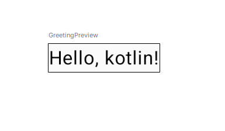

### Text
```kotlin
Text(
    text = "Welcome to Jetpack Compose!",
    color = Color.Blue,
    fontSize = 18.sp,
    fontWeight = FontWeight.Bold
)
```
## Button
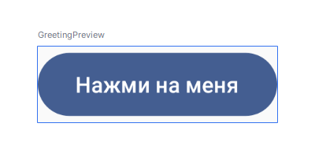
```kotlin
Button(onClick = { /* Событие нажатия */ }) {
    Text("Нажми на меня")
}
```
## Image
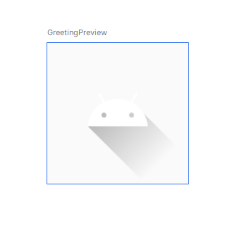
```kotlin
Image(
            painter = painterResource(id = R.drawable.ic_launcher_foreground),
            contentDescription = "Example image",
            modifier = Modifier.size(100.dp)
        )
```
## TextField

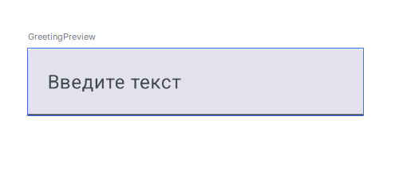

```kotlin
 var text by remember { mutableStateOf("") }
        TextField(
            value = text,
            onValueChange = { text = it },
            label = { Text("Введите текст") }
        )

```

# 📐 Расположение элементов (Layout)

Compose предоставляет мощные инструменты для верстки, позволяя компоновать элементы вертикально, горизонтально или накладывать их друг на друга.


## Column Колонка (вертикальная группа элементов ):

Элементы размещаются друг под другом.

Свойства:
* verticalArrangement — управление расстоянием между элементами (например, SpaceAround, Top).
* horizontalAlignment — выравнивание по горизонтали (например, CenterHorizontally, Start).


```kotlin
Column {
    Text("Элемент 1")
    Text("Элемент 2")
}

```

## Row Ряд (горизонтальная группа):
Элементы размещаются в строку.
Свойства:
* horizontalArrangement — управление расстоянием между элементами (например, SpaceEvenly, Start).
* verticalAlignment — выравнивание по вертикали (например, CenterVertically, Top).

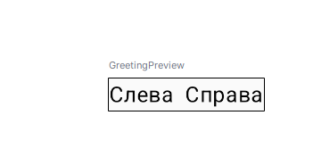

```kotlin
Row {
    Text("Слева")
    Spacer(modifier = Modifier.width(8.dp))
    Text("Справа")
}


```

## Box коробка (накладывающиеся элементы):

Элементы накладываются друг на друга.

Свойства:
* contentAlignment — задает выравнивание вложенных элементов.
* Используй модификаторы align(Alignment) для индивидуального выравнивания.

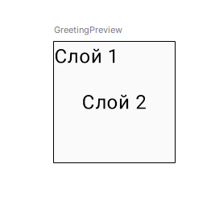

```kotlin

Box(modifier = Modifier.size(100.dp)) {
    Text("Слой 1", modifier = Modifier.align(Alignment.TopStart))
    Text("Слой 2", modifier = Modifier.align(Alignment.Center))
}

```
## LazyColumn (список) 

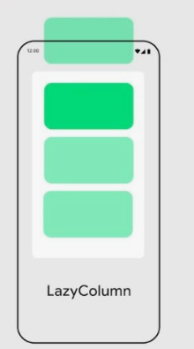

Для работы с длинными списками или динамическими данными.
Свойства:
* items() — генерирует элементы из списка или диапазона.
* verticalArrangement — расстояние между элементами.

```kotlin
@Composable
fun LazyColumnExample() {
    LazyColumn(
        modifier = Modifier.fillMaxSize(),
        verticalArrangement = Arrangement.spacedBy(8.dp)
    ) {
        items(50) { index ->
            Text("Item $index", modifier = Modifier.padding(8.dp))
        }
    }
}
```
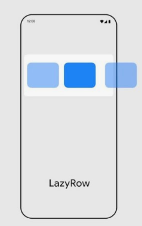

## LazyRow (горизонтальный список)

Свойства:
* items() — генерирует элементы из списка или диапазона.
* horizontalArrangement  — расстояние между элементами.

```kotlin 
@Composable
fun LazyRowExample() {
    LazyRow(
        modifier = Modifier.fillMaxWidth(),
        horizontalArrangement = Arrangement.spacedBy(8.dp)
    ) {
        items(50) { index ->
            Text("Item $index", modifier = Modifier.padding(8.dp))
        }
    }
}
```
## Spacer (разделитель пространства)

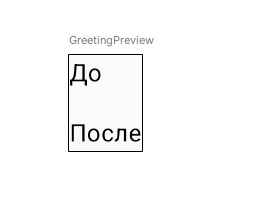

```kotlin
@Composable
fun SpacerExample() {
    Column {
        Text("До")
        Spacer(modifier = Modifier.height(16.dp))
        Text("После")
    }
}
```

## ConstraintLayout (сложная компоновка)
Для более сложных схем.


```kotlin
@Composable
fun ConstraintLayoutExample() {
    ConstraintLayout(
        modifier = Modifier.fillMaxSize()
    ) {
        val (text1, text2, button) = createRefs()

        Text(
            "Hello",
            modifier = Modifier.constrainAs(text1) {
                top.linkTo(parent.top)
                start.linkTo(parent.start)
            }
        )
        Text(
            "World",
            modifier = Modifier.constrainAs(text2) {
                top.linkTo(text1.bottom)
                start.linkTo(text1.end)
            }
        )
        Button(
            onClick = { },
            modifier = Modifier.constrainAs(button) {
                bottom.linkTo(parent.bottom)
                end.linkTo(parent.end)
            }
        ) {
            Text("Click me")
        }
    }
}

```


## 📺 Modifier: Настройка внешнего вида
### Модификаторы позволяют изменять размер, выравнивание, отступы, фоны и многое другое.

```kotlin 
 @Composable
        fun ModifierExample() {
            Text(
                "Styled Text",
                modifier = Modifier
                    .padding(16.dp)
                    .background(Color.LightGray)
                    .fillMaxWidth()
                    .height(50.dp)
                    .clickable { /* Handle click */ }
            )
        }

        ModifierExample()
```
### Основные модификаторы:

* padding(), margin() — отступы.
* background() — фоновый цвет или изображение.
* clickable() — обработка нажатий.
* fillMaxSize(), wrapContentSize() — размер компонента.

## Cостояние (State)

Compose поддерживает реактивность через управление состоянием.


### Работа с состоянием через remember и mutableStateOf:
```kotlin
@Composable
fun Counter() {
    var count by remember { mutableStateOf(0) }
    Button(onClick = { count++ }) {
        Text("Clicked $count times")
    }
}

```


# Темы и стили

### Цвета и шрифты:
Применяем к тексту Hello, цвет синий, размер шрифта 24, жирный
```kotlin
Text(
    text = "Hello",
    color = Color.Blue,
    fontSize = 24.sp,
    fontWeight = FontWeight.Bold
)

```
###  Темы:

```kotlin
MaterialTheme {
    Greeting("Compose")
}
```


Применение темы нашего приложения, для применения оформления темы оборачиваем элементы темой:
## Без темы
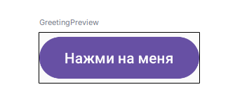
## С темой
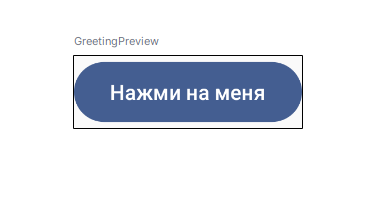

```kotlin
ExampleAppTheme {
    Button(onClick = { /* Событие нажатия */ }) {
    Text("Нажми на меня")
}
}

```

# 🎎 Пользовательские компоненты (Custom Composables)

### Создание своих Composable-функций позволяет повторно использовать элементы интерфейса и упрощать код.

## Пример: Пользовательский текст с градиентом

```kotlin

@Composable
fun GradientText(text: String, gradient: Brush) {
    Text(
        text = text,
        style = TextStyle(
            brush = gradient,
            fontSize = 24.sp,
            fontWeight = FontWeight.Bold
        )
    )
}

val gradient = Brush.linearGradient(
    colors = listOf(Color.Red, Color.Blue)
)

GradientText(text = "Jetpack Compose", gradient = gradient)

```


# 🌟 Анимации в Jetpack Compose

Compose делает анимации простыми и декларативными.


Для применения анимации в приложении Jetpack Compose предоставляет специальный API - Animation API. Этот API состоит из классов и функций, которые предоставляют широкие возможности по созданию анимации. Рассмотрим ключевые функции и классы Animation API.

Так, Compose Animation API предоставляет ряд анимаций состояния компонентов. В частности, это функции анимации для значений типов Bounds, Color, Dp, Float, Int, IntOffset, IntSize, Offset, Rect и Size. Подобные функции покрывают большинство потребностей в анимации компонентов.

Подобные функции анимаций используют одно и то же соглашение об именах. В частности, все они называются по шаблону:
```	
animate*AsState
```

## Простая анимация

### Использование animate*AsState для изменения цвета animateColorAsState:

```kotlin
val color by animateColorAsState(if (isClicked) Color.Red else Color.Green)

```
### Использование animate*AsState для изменения размера animateDpAsState:

```kotlin

val size by animateDpAsState(targetValue = if (isExpanded) 200.dp else 100.dp)
Box(Modifier.size(size)
```

### Использование animateDpAsState для перемещения объектов:

```kotlin
val color by animateColorAsState(if (isClicked) Color.Red else Color.Green)

```


### Использование переходов (Transitions):


```kotlin

val transition = updateTransition(targetState = isExpanded)
val size by transition.animateDp { state ->
    if (state) 200.dp else 100.dp
}
Box(Modifier.size(size))

```

### Keyframes для сложных эффектов:


```kotlin

val offset by animateDpAsState(
    targetValue = 100.dp,
    animationSpec = keyframes {
        durationMillis = 1000
        50.dp at 200
        150.dp at 500
    }
)
Box(Modifier.offset(y = offset))


```
###  Жесты и анимация с draggable:


```kotlin

val offsetX = remember { Animatable(0f) }
Box(
    Modifier
        .offset { IntOffset(offsetX.value.roundToInt(), 0) }
        .draggable(
            orientation = Orientation.Horizontal,
            state = rememberDraggableState { delta ->
                offsetX.snapTo(offsetX.value + delta)
            }
        )
)


```
### Анимация содержимого (AnimatedContent):


```kotlin

AnimatedContent(targetState = counter) { target ->
    Text("Count: $target")
}

```


## Анимация изменения состояния

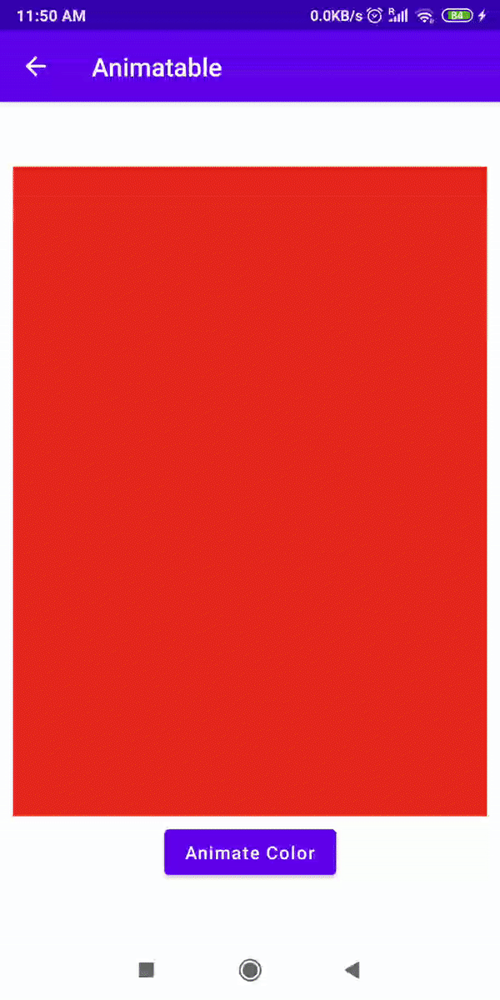

```kotlin
@Composable
private fun AnimatableSample() {
    var isAnimated by remember { mutableStateOf(false) }

    val color = remember { Animatable(Color.DarkGray) }

    // animate to green/red based on `button click`
    LaunchedEffect(isAnimated) {
        color.animateTo(if (isAnimated) Color.Green else Color.Red, animationSpec = tween(2000))
    }

    Box(
        Modifier
            .fillMaxWidth()
            .fillMaxHeight(0.8f)
            .background(color.value)
    )
    Button(
        onClick = { isAnimated = !isAnimated },
        modifier = Modifier.padding(top = 10.dp)
    ) {
        Text(text = "Animate Color")
    }
}
```
## Анимация размера:

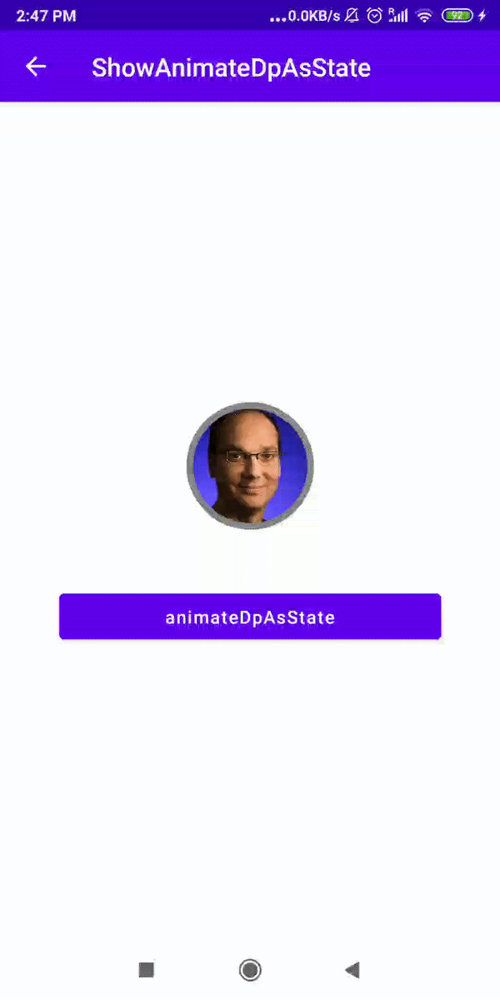

```kotlin
@Composable
fun CircleImage(imageSize: Dp) {
    Image(
        painter = painterResource(R.drawable.andy_rubin),
        contentDescription = "Circle Image",
        contentScale = ContentScale.Crop,  
        modifier = Modifier
            .size(imageSize)
            .clip(CircleShape) 
            .border(5.dp, Color.Gray, CircleShape) 
    )
}

@Composable
private fun AnimateDpAsState() {
    val isNeedExpansion = rememberSaveable{ mutableStateOf(false) }
    
    val animatedSizeDp: Dp by animateDpAsState(targetValue = if (isNeedExpansion.value) 350.dp else 100.dp)

    Column(horizontalAlignment = Alignment.CenterHorizontally) {
        CircleImage(animatedSizeDp)
        Button(
            onClick = { 
            isNeedExpansion.value = !isNeedExpansion.value 
            },
            modifier = Modifier
                .padding(top = 50.dp)
                .width(300.dp)
        ) {
            Text(text = "animateDpAsState")
        }
    }
}
```

## 📊 Визуализация в реальном времени

### Использование LaunchedEffect

```kotlin
@Composable
fun Timer() {
    var time by remember { mutableStateOf(0) }
    LaunchedEffect(Unit) {
        while (true) {
            delay(1000)
            time++
        }
    }
    Text("Time: $time")
}

```

###  Работа с Flow

```kotlin
@Composable
fun FlowExample(flow: Flow<Int>) {
    val value by flow.collectAsState(initial = 0)
    Text("Flow value: $value")
}


```

# 📚 Документация

[Jetpack Compose Basics Codelab](https://developer.android.com/codelabs/jetpack-compose-basics#0)

[Compose Animations](https://developer.android.com/jetpack/compose/animation)

[Column](https://developer.android.com/develop/ui/compose/layouts/basics)


[Spacer](https://developer.android.com/develop/ui/compose/modifiers?hl=ru/)

[Divider](https://developer.android.com/develop/ui/compose/components/divider?hl=ru)

[Layout in Compose](https://developer.android.com/jetpack/compose/layouts)

[ Card](https://developer.android.com/develop/ui/compose/components/card)

[TextField ](https://developer.android.com/develop/ui/compose/text/user-input?hl=ru)


[ Кнопка](https://developer.android.com/develop/ui/compose/components/button?hl=ru)


[Text](https://developer.android.com/develop/ui/compose/layouts/basics)

[Preview](https://developer.android.com/develop/ui/compose/tooling/previews)

[topBar](https://developer.android.com/develop/ui/compose/components/app-bars)

[floatingActionButton ](https://developer.android.com/develop/ui/compose/components/fab?hl=ru)

[Shared-preferences](https://developer.android.com/training/data-storage/shared-preferences)

[DataStore](https://developer.android.com/topic/libraries/architecture/datastore)

[Room](https://developer.android.com/training/data-storage/room)


